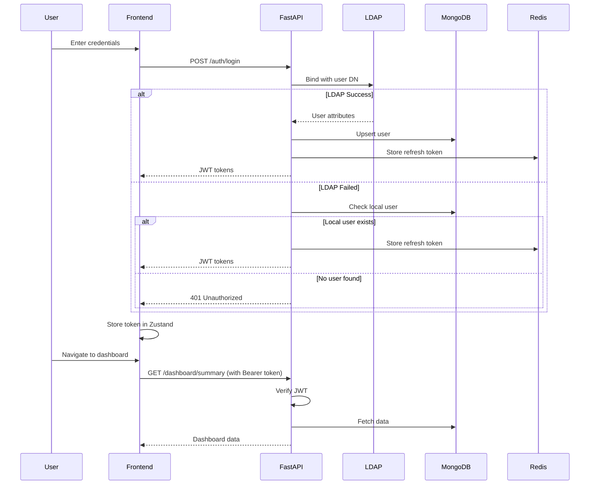

# Amana-GRC Architecture Documentation

## System Architecture

Amana-GRC is built as a modern, cloud-native application with the following architecture:

```
┌─────────────────────────────────────────────────────────────┐
│                       Client Layer                          │
│  React SPA with RTL support, i18n, TanStack Query          │
└─────────────────┬───────────────────────────────────────────┘
                  │ HTTPS/REST
┌─────────────────▼───────────────────────────────────────────┐
│                    API Gateway Layer                        │
│           FastAPI with OpenAPI documentation                │
└─────┬────────────┬────────────┬──────────────┬──────────────┘
      │            │            │              │
      │            │            │              │
┌─────▼─────┐ ┌───▼─────┐ ┌───▼──────┐ ┌────▼────────┐
│   Auth    │ │  Data   │ │   AI     │ │   Cache     │
│  Service  │ │ Service │ │ Service  │ │   (Redis)   │
│ (LDAP+JWT)│ │ (Beanie)│ │ (vLLM)   │ │             │
└─────┬─────┘ └───┬─────┘ └───┬──────┘ └─────────────┘
      │           │            │
┌─────▼───────────▼────────────┴──────────────────────┐
│               Data Persistence Layer                │
│                  MongoDB 7+                         │
└──────────────────────────────────────────────────────┘
```

## Technology Stack

### Backend
- **Framework:** FastAPI 0.115+ (Python 3.12+)
- **ORM:** Beanie 1.27+ (built on Motor async driver)
- **Database:** MongoDB 7+
- **Cache:** Redis 7
- **Authentication:** ldap3 + PyJWT
- **AI Client:** httpx for vLLM API calls

### Frontend
- **Framework:** React 18.3+
- **Build Tool:** Vite 6+
- **Language:** TypeScript 5.7+
- **Styling:** Tailwind CSS 4 with RTL plugin
- **State Management:** Zustand 5 + TanStack Query 5
- **Routing:** React Router 7
- **i18n:** i18next + react-i18next
- **Charts:** Recharts 2.13+
- **Icons:** Lucide React

## Data Model

### Core Entities

1. **User**
   - Supports both LDAP and local authentication
   - Role-based access control (Admin, Risk Officer, Auditor, Viewer)
   - Bilingual name fields

2. **Standard**
   - Regulatory framework metadata
   - Pre-loaded with Saudi standards (NCA-ECC, NCA-CSCC, NDMO, SDAIA)

3. **Control**
   - Specific control requirements from standards
   - Bilingual descriptions
   - Implementation status tracking

4. **Risk**
   - ISO 31000-aligned risk assessment
   - 5×5 risk matrix (Impact × Likelihood)
   - Auto-calculated risk scores and levels

5. **Evidence**
   - Supporting documentation for control implementation
   - AI-powered compliance assessment
   - Review workflow (Pending → Approved/Rejected)

6. **Audit**
   - Audit engagement management
   - Status workflow (Planned → In Progress → Completed → Closed)
   - Multi-auditor support

7. **NonConformity**
   - Audit findings tracking
   - Severity levels (Observation → Minor → Major → Critical)
   - Corrective action management

## Authentication Flow



## AI Integration

The platform integrates with vLLM serving Qwen3-Coder-MoE FP8:

1. **Evidence Analysis:**
   - User uploads evidence document
   - System extracts text content
   - Sends to vLLM with control context
   - Receives structured compliance assessment

2. **Graceful Degradation:**
   - If vLLM is unavailable, AI features show offline state
   - Core GRC functionality remains operational

3. **Bilingual Output:**
   - AI provides reasoning in both Arabic and English
   - Confidence scores calibrated for audit use

## Internationalization (i18n)

### Implementation
- **Library:** i18next with react-i18next
- **Languages:** Arabic (ar) with RTL, English (en) with LTR
- **Dynamic Switching:** Instant language toggle without page reload
- **Layout Direction:** Automatic RTL/LTR based on language
- **Font:** IBM Plex Sans Arabic for optimal rendering

### RTL Handling
1. `document.dir` set to 'rtl' or 'ltr'
2. `document.lang` set to 'ar' or 'en'
3. Tailwind RTL plugin provides `rtl:` and `ltr:` variants
4. Logical CSS properties (margin-inline-start vs margin-left)

## Security

### Authentication Mechanisms
1. **LDAP/Active Directory:** Primary for municipal users
2. **Local Accounts:** Fallback for admin access

### Authorization
- Role-based access control (RBAC)
- Route-level permission checking
- JWT tokens with 15-minute expiry
- Refresh tokens stored in Redis with 7-day TTL

### Data Protection
- Password hashing with bcrypt
- JWT secret key configuration
- CORS restrictions
- HTTPS in production (via reverse proxy)

## Scalability Considerations

### Horizontal Scaling
- **Backend:** Stateless design allows multiple instances
- **Frontend:** Static assets served via CDN
- **Database:** MongoDB replica sets for HA
- **Redis:** Sentinel or Cluster mode for cache HA

### Performance Optimizations
- **MongoDB Indexes:** On frequently queried fields
- **TanStack Query:** Client-side caching and deduplication
- **Lazy Loading:** Frontend code splitting
- **Connection Pooling:** Database connection reuse

## Deployment Architecture

### Development
```
docker-compose up -d
```

### Production
```
- Load Balancer (nginx/traefik)
- Multiple FastAPI instances
- MongoDB replica set (3+ nodes)
- Redis Sentinel/Cluster
- Separate vLLM inference server
```

## Monitoring & Observability

### Logging
- Structured logging in JSON format
- Request/response logging middleware
- Error tracking and alerting

### Metrics
- API response times
- Database query performance
- Cache hit rates
- vLLM inference latency

### Health Checks
- `/health` endpoint for load balancer probes
- Database connectivity checks
- Redis connectivity checks
